# Core Technologies Deep Dive

> **Supplement to Technical Documentation**
> **Project**: BDH Narrative Consistency Classifier
> **Technique**: "Brain-Nervous-Cognitive" Synergistic Architecture

This document details how the three pillars of our architecture—**BDH (Brain)**, **Pathway (Nervous System)**, and **LangGraph (Cognitive)**—are integrated to their fullest potential to solve the narrative consistency challenge.

---

## 1. The "Brain": BDH Architecture
### *Storing and Organizing Temporal Memory*

The **Brain-inspired Dynamic Hierarchical (BDH)** model is not just a standard transformer; it is a **memory-centric architecture** designed for lifelong learning and long-context retention. We utilize it to create a structured mapping of the narrative world.

### 1.1 Multi-Scale Temporal Dynamics
Standard models treat text as a flat sequence. Our BDH implementation acknowledges that stories happen at multiple time scales simultaneously.

- **How we utilize it**:
    - **Sentence Encoder (Windows of 64)**: Captures immediate actions and dialogue ("He drew his sword").
    - **Paragraph Encoder (Windows of 256)**: Captures scenes and interactions ("The tavern brawl lasted ten minutes").
    - **Chapter Encoder (Windows of 1024)**: Captures arcs and thematic shifts ("The Journey to the West").
- **Dynamic Gating ("Automatic Transmission")**:
    - We don't just sum these outputs. An **MLP Gating Network** constantly monitors the input entropy.
    - *Example*: During fast dialogue, the gate swings to the **Sentence Encoder**. During descriptive exposition, it shifts to the **Chapter Encoder**.

### 1.2 Hebbian Plasticity & Checkpoints
We treat the neural weights not as fixed values, but as **evolving synaptic strengths**.

- **Hebbian Learning Rule**:
    - `Δw = η * (pre * post) - γ * w`
    - We track *co-activations* between character entities and events. If "Grant" and "Captain" appear together often, their synaptic bond strengthens.
- **Delta Checkpointing**:
    - Instead of saving the full brain state (GBs) every few steps, we save **Compressed Deltas**.
    - This allows us to "rewind" the brain to any narrative point to verify a claim. "Was he a captain *before* chapter 5?" — we can check the weight state at step $t=1000$.
- **Homeostatic Normalization ("Better Suspension")**:
    - To prevent "runaway excitation" (epilepsy in biological brains, exploding gradients in silicon), we implemented a homeostatic layer that dynamically scales activity to maintain ~10% sparsity.

---

## 2. The "Nervous System": Pathway Streamliners
### *Real-Time Data Ingestion & Reflexes*

**Pathway** acts as the high-speed nervous system, delivering sensory data (text) to the brain (BDH) with zero latency and high throughput.

### 2.1 Why Pathway?
Static `DataLoader`s are insufficient for "living" narratives where context might update or expand (e.g., a sequel is added).

- **Reactive Streaming**:
    - Pathway watches the `./dataset/books/` directory. If a new chapter file is dropped in, the pipeline **automatically triggers**.
    - No restart required. The nervous system simply "feels" the new input and processes it.

### 2.2 Hierarchical Data Marshaling
Pathway doesn't just pass strings; it structures them for the multi-scale brain.

- **The Pipeline**:
    1. **Ingest**: Read raw bytes from filesystem.
    2. **Reflex Processing**: `TextProcessor` splits text into `(Sentence, Paragraph, Chapter)` tuples *on the fly*.
    3. **Tensorization**: Converts text to tensor batches ready for the GPU.
- **Efficiency**:
    - Heavy text processing happens in parallel Rust threads (via Pathway's core), leaving the Python Main Thread free for GPU coordination.

---

## 3. The "Cognitive Cortex": LangGraph + Gemini
### *Reasoning, Verification, and Logic*

While BDH provides *intuition* and *memory*, it lacks explicit *logic*. This is where **LangGraph** (orchestration) and **Gemini** (LLM) come in as the "Prefrontal Cortex".

### 3.1 Cognitive Architecture Flow
We model reasoning as a **Directed Acyclic Graph (DAG)** of cognitive operations, not a single prompt.

```mermaid
graph LR
    Input(Claim) --> Filter(Attention Filter)
    Filter --> Verify[Gemini: Verification]
    Verify -->|Irrelevant| Discard[🗑️]
    Verify -->|Relevant| Memory[Working Memory]
    Memory --> Classify[Gemini: Logic]
    Classify --> Output(Principled Verdict)
```

### 3.2 Differentiable Logic ("Fuel Injection")
We inject "fuel" (context) into the reasoning process dynamically.

- **Dynamic Query Generation**:
    - The `TrajectoryAttentionPooling` layer looks at the global context of the backstory.
    - It generates a specific **Query Vector** to "hunt" for confirmation in the BDH memory.
    - *Example Backstory*: "He died at sea." -> *Query*: Generated vector emphasizes "ocean", "death", "ship" features.
    
### 3.3 The Role of Gemini
We don't ask Gemini to "read the book" (too expensive/slow). We ask it to act as a **Logic Unit**:
1. **Micro-Task**: "Does Sentence A prove Claim B?" (Verification Node)
2. **Macro-Task**: "Given these 5 proven facts, is the backstory consistent?" (Classification Node)

This **Neuro-Symbolic** approach combines the massive context handling of BDH/Hebbian networks with the precise reasoning of LLMs.

---

## Summary of Integration

| Component | Biological Analogy | Function in Project |
|-----------|--------------------|---------------------|
| **Multi-Scale BDH** | Hippocampus / Cortex | Long-term hierarchical memory & pattern recognition |
| **Pathway** | Sensory Nervous System | Fast, reactive data streaming & preprocessing |
| **LangGraph/Gemini**| Prefrontal Cortex | Conscious reasoning, logic, and verification |
| **Hebbian Checkpoints**| Synaptic Plasticity | Tracking how knowledge evolves over time |

---

## 4. Data & Memory Lifecycle Diagram

A visualization of how data flows from the "Nervous System" (Pathway) into "Memory Storage" (TOON).

```mermaid
graph TD
    subgraph DataStream["🌊 Pathway Data Stream"]
        Raw[("📄 Raw Text Files")]
        Watcher[("👀 Directory Watcher")]
        Stream[("⚡ Pathway Streamliner")]
        Chunker[("🔪 Hierarchical Chunker")]
        
        Raw --> Watcher
        Watcher --> Stream
        Stream --> Chunker
    end

    subgraph Formatting["🔄 Data Formatting"]
        Chunker -->|Sentence| L1[("S-Data")]
        Chunker -->|Paragraph| L2[("P-Data")]
        Chunker -->|Chapter| L3[("C-Data")]
        
        L1 & L2 & L3 --> Batch[("📦 Tensor Batch")]
    end

    subgraph Memory["🧠 BDH Memory & Checkpoints"]
        Batch --> Model[("🕸️ Multi-Scale BDH")]
        Model --> Hebbian[("⚡ Hebbian Update")]
        
        Hebbian --> Delta[("📉 Delta Computation")]
        Delta --> Compress[("🗜️ zlib Compression")]
        
        Compress --> TOON[("📝 TOON Formatting")]
        TOON --> Storage[("💾 Disk Storage (.toon + .pt)")]
    end

    style DataStream fill:#e1f5fe,stroke:#01579b
    style Formatting fill:#fff3e0,stroke:#e65100
    style Memory fill:#f3e5f5,stroke:#4a148c
```

