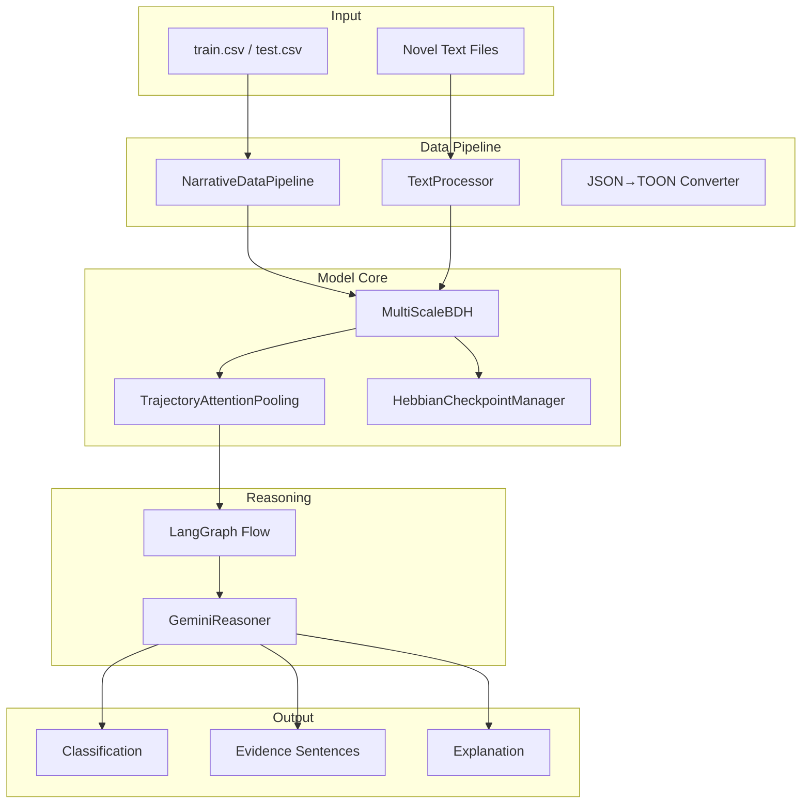
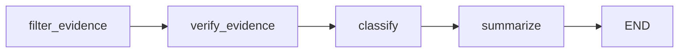

# BDH Narrative Consistency Classifier - Technical Documentation

> **Version**: 1.0  
> **Hackathon**: Kharagpur Data Science Hackathon 2026 - Track B  
> **Last Updated**: January 2026

---

## Table of Contents

1. [Architecture Overview](#architecture-overview)
2. [Module Reference](#module-reference)
   - [config.py](#configpy)
   - [multi_scale_bdh.py](#multi_scale_bdhpy)
   - [hebbian_checkpoint.py](#hebbian_checkpointpy)
   - [trajectory_attention.py](#trajectory_attentionpy)
   - [text_processor.py](#text_processorpy)
   - [data_pipeline.py](#data_pipelinepy)
   - [reasoning_graph.py](#reasoning_graphpy)
   - [train_classifier.py](#train_classifierpy)
   - [inference.py](#inferencepy)
   - [utils.py](#utilspy)
3. [Data Flow](#data-flow)
4. [API Reference](#api-reference)
5. [Core Technologies Deep Dive](CORE_TECHNOLOGIES.md)

---

## Architecture Overview



---

## Module Reference

---

### config.py

**Purpose**: Master configuration for all hyperparameters and settings.

#### Classes

| Class | Description |
|-------|-------------|
| `ModelConfig` | BDH model hyperparameters (layers, embedding dim, heads) |
| `TemporalScaleConfig` | Multi-scale window and stride settings |
| `HebbianConfig` | Checkpoint intervals and learning parameters |
| `PathwayConfig` | Streaming batch/buffer configuration |
| `GeminiConfig` | LLM model name, API key, generation settings |
| `TrainingConfig` | Epochs, learning rate, batch size |
| `Config` | Master config combining all above |

#### Key Configuration Values

```python
# Model
n_layer: 6
n_embd: 256
n_head: 4

# Temporal Scales
sentence_window: 64
paragraph_window: 256
chapter_window: 1024

# Gemini
model_name: "gemini-2.0-flash"
temperature: 0.3
```

#### Usage

```python
from config import get_config
config = get_config()
print(config.model.n_embd)  # 256
```

---

### multi_scale_bdh.py

**Purpose**: Core BDH architecture with multi-scale temporal dynamics.

#### Classes

| Class | Parameters | Description |
|-------|------------|-------------|
| `RoPEAttention` | D, nh | Rotary Position Embedding attention |
| `HomeostaticNorm` | dim, target | **[NEW]** Dynamic activity normalization ("Better Suspension") |
| `BDHLayer` | config | Single BDH layer with sparse gating |
| `TemporalScaleBDH` | config, scale_name | BDH encoder for one temporal scale |
| `MultiScaleBDH` | model_config, temporal_config | Full multi-scale encoder with **Dynamic Gating** |

#### Key Methods

```python
# MultiScaleBDH
def forward(input_ids, return_all_states=False):
    """
    Args:
        input_ids: [B, T] token indices
        return_all_states: whether to return layer states
    
    Returns:
        fused_output: [B, T, D] cross-scale fused representation
        states: dict with scale weights and layer states
    """

def get_layer_parameters():
    """Extract layer states for checkpointing"""
```

#### Architecture

```
Input → Embedding → [Sentence BDH] ─┐
                  → [Paragraph BDH] ├→ [Gating Network] → Output
                  → [Chapter BDH] ──┘
```

---

### hebbian_checkpoint.py

**Purpose**: Checkpoint management with delta compression and TOON storage.

#### Classes

| Class | Description |
|-------|-------------|
| `Checkpoint` | Single checkpoint with layer states and metadata |
| `DeltaCheckpoint` | Compressed delta between checkpoints |
| `HebbianCheckpointManager` | Main checkpoint orchestrator |
| `HebbianLearningRule` | Hebbian weight update computation |
| `CheckpointTOONStorage` | TOON format serialization |

#### Key Methods

```python
# HebbianCheckpointManager
def save_checkpoint(layer_states, step, metadata=None):
    """Save checkpoint with delta compression"""

def retrieve_state(step):
    """Reconstruct state at specific step from deltas"""

def get_layer_trajectory(layer_name):
    """Get delta norms over time for analysis"""

# CheckpointTOONStorage
def save_checkpoint_toon(manager, session_id):
    """Export to human-readable TOON format"""

def load_checkpoint_toon(toon_path, config):
    """Restore from TOON file"""
```

#### TOON Output Format

```toon
[metadata]
session_id = "training_v1"
total_checkpoints = 50
current_step = 5000

[[checkpoints]]
step = 100
tensor_file = "cp_training_v1_100.pt"

[[deltas]]
from_step = 0
to_step = 100
layer0 = 2.34
```

---

### trajectory_attention.py

**Purpose**: Attention-based pooling and evidence extraction.

#### Classes

| Class | Description |
|-------|-------------|
| `TrajectoryAttentionPooling` | Attention pooling with **Dynamic Queries** ("Fuel Injection") |
| `HierarchicalTrajectoryPooling` | Multi-scale pooling fusion |
| `EvidenceExtractor` | Extract top-k sentences from attention |

#### Key Methods

```python
# TrajectoryAttentionPooling
def forward(x, attention_mask=None, return_attention=False, return_pooled=False):
    """
    Args:
        x: [B, T, D] sequence representations
        return_pooled: if True, return [B, D] pooled; else [B, C] logits
    
    Returns:
        output: pooled representation or classification logits
        attention_weights: [B, nh, T] if return_attention=True
    """
```

---

### text_processor.py

**Purpose**: Hierarchical text chunking and alignment.

#### Classes

| Class | Description |
|-------|-------------|
| `ProcessedText` | Container for sentences, paragraphs, chapters |
| `TextProcessor` | Main processor for extracting structure |
| `BackstoryAligner` | Find relevant passages for backstory |

#### Key Methods

```python
# TextProcessor
def process(text):
    """
    Returns:
        ProcessedText with:
        - sentences: List[str]
        - paragraphs: List[str]  
        - chapters: List[str]
    """

# BackstoryAligner
def find_relevant_passages(backstory, processed_text, top_k=5):
    """
    Returns:
        List of (sentence_idx, sentence_text, relevance_score)
    """
```

---

### data_pipeline.py

**Purpose**: Data loading, streaming, and TOON conversion.

#### Classes

| Class | Description |
|-------|-------------|
| `NarrativeExample` | Single training/test example |
| `NarrativeDataPipeline` | Main data loader and processor |
| `PathwayStreamPipeline` | Pathway-based streaming (optional) |
| `JSONToTOONConverter` | JSON to TOON format converter |

#### Key Methods

```python
# NarrativeDataPipeline
def load_train_csv(csv_path):
    """Load labeled training examples"""

def load_test_csv(csv_path):
    """Load unlabeled test examples"""

def prepare_examples(examples, load_books=True):
    """Attach book text and process narratives"""

def load_book(book_name):
    """Load and cache book from file"""

# TOON Conversion
def json_to_toon(data, output_path=None):
    """Convert JSON dict to TOON string"""

def results_to_toon(results, output_path=None):
    """Convert prediction results to TOON"""
```

---

### reasoning_graph.py

**Purpose**: LangGraph flow with Gemini for evidence verification.

#### Classes

| Class | Description |
|-------|-------------|
| `Evidence` | Single evidence piece with explanation |
| `ReasoningResult` | Complete reasoning output |
| `ReasoningState` | LangGraph state definition |
| `GeminiReasoner` | Direct Gemini API wrapper |
| `ReasoningGraph` | LangGraph workflow orchestrator |

#### Key Methods

```python
# GeminiReasoner
def verify_evidence(backstory, candidate_sentence, character):
    """
    Returns:
        (is_relevant, explanation, confidence)
    """

def classify_consistency(backstory, evidence_sentences, character):
    """
    Returns:
        (classification, confidence, summary)
    """

# ReasoningGraph
def run(backstory, narrative_sentences, character, candidate_evidence):
    """
    Full LangGraph pipeline:
    1. Filter candidates
    2. Verify with Gemini
    3. Classify consistency
    4. Generate summary
    
    Returns:
        ReasoningResult
    """
```

#### LangGraph Flow



---

### train_classifier.py

**Purpose**: Complete training pipeline.

#### Classes

| Class | Description |
|-------|-------------|
| `SimpleTokenizer` | Byte-level tokenizer fallback |
| `NarrativeDataset` | PyTorch dataset for training |
| `NarrativeClassifier` | Full classification model |

#### Key Functions

```python
def train_epoch(model, dataloader, optimizer, device, checkpoint_manager, epoch, config):
    """Single training epoch with checkpointing"""

def evaluate(model, dataloader, device):
    """Evaluation loop returning loss and accuracy"""

def main():
    """CLI entry point for training"""
```

#### CLI Usage

```bash
python train_classifier.py \
    --train-csv Dataset/train.csv \
    --books-dir Dataset/Books \
    --epochs 50 \
    --batch-size 4 \
    --device cuda
```

---

### inference.py

**Purpose**: Prediction pipeline with evidence extraction.

#### Classes

| Class | Description |
|-------|-------------|
| `InferencePipeline` | Complete inference orchestrator |

#### Key Methods

```python
def predict(backstory, narrative_text, character="", return_evidence=True):
    """
    Single prediction with evidence.
    
    Returns:
        {
            'label': 'consistent' or 'inconsistent',
            'score': float,
            'supporting_sentences': List[dict],
            'explanation': str
        }
    """

def predict_csv(csv_path, books_dir, output_path, sample=None):
    """Batch prediction on CSV file"""
```

#### CLI Usage

```bash
# Batch mode
python inference.py --input-csv Dataset/test.csv --output results.csv

# Single prediction
python inference.py --backstory "text" --narrative path/to/book.txt
```

---

### utils.py

**Purpose**: Utility functions and helpers.

#### Functions

| Function | Description |
|----------|-------------|
| `set_seed(seed)` | Set random seeds for reproducibility |
| `count_parameters(model)` | Count trainable parameters |
| `format_number(n)` | Format with K/M/B suffixes |
| `get_device()` | Get best available device |
| `save_json(data, path)` | Save JSON file |
| `load_json(path)` | Load JSON file |

#### Classes

| Class | Description |
|-------|-------------|
| `EarlyStopping` | Early stopping handler |
| `MetricTracker` | Track and log training metrics |

---

## Data Flow

```
1. CSV Loading
   train.csv → NarrativeDataPipeline.load_train_csv()
   ↓
2. Book Processing  
   Books/*.txt → TextProcessor.process() → ProcessedText
   ↓
3. Example Preparation
   NarrativeExample + ProcessedText → prepare_examples()
   ↓
4. Tokenization
   backstory + narrative → SimpleTokenizer → input_ids
   ↓
5. Encoding
   input_ids → MultiScaleBDH → [B, T, D] representations
   ↓
6. Pooling
   representations → TrajectoryAttentionPooling → [B, D] pooled
   ↓
7. Classification
   pooled → Linear → logits → prediction
   ↓
8. Reasoning (optional)
   candidates → GeminiReasoner → verified evidence + explanation
   ↓
9. Output
   {label, score, evidence, explanation} → results.csv
```

---

## API Reference

### Quick Start

```python
from src.config import get_config
from src.data_pipeline import NarrativeDataPipeline
from src.reasoning_graph import create_reasoning_graph

# Configuration
config = get_config()

# Load data
pipeline = NarrativeDataPipeline(config.pathway, 'Dataset', 'Dataset/Books')
examples = pipeline.load_test_csv('Dataset/test.csv')
examples = pipeline.prepare_examples(examples, load_books=True)

# Create reasoning graph
reasoner = create_reasoning_graph(config.gemini)

# Run inference
for example in examples:
    result = reasoner.run(
        backstory=example.backstory,
        narrative_sentences=example.processed_narrative.sentences,
        character=example.character,
        candidate_evidence=[(0, "sentence", 0.9)]
    )
    print(f"{result.classification}: {result.summary}")
```

---

## File Structure

```
src/
├── __init__.py              # Package init
├── config.py                # Configuration classes
├── multi_scale_bdh.py       # Multi-scale BDH encoder
├── hebbian_checkpoint.py    # Checkpoint management + TOON
├── trajectory_attention.py  # Pooling and evidence extraction
├── text_processor.py        # Text chunking and alignment
├── data_pipeline.py         # Data loading + JSON→TOON
├── reasoning_graph.py       # LangGraph + Gemini
├── train_classifier.py      # Training pipeline
├── inference.py             # Inference pipeline
├── utils.py                 # Utilities
└── requirements.txt         # Dependencies
```
